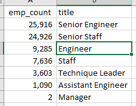
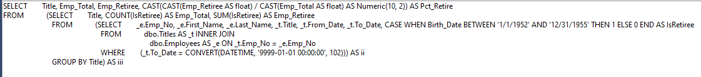
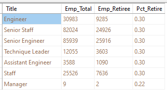
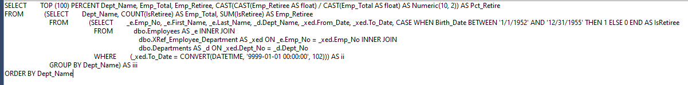
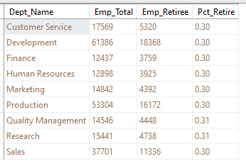

# Pewlett-Hackard-Analysis
## Overview of Analysis

### Due to a large amount of impending retirements in the Pewlett-Hackard company, we have been tasked with analyzing company data to establish how many and which employees will be retiring in order to assist in preperation for the staffing loss. We will also detrmine which of the remaining employees might make good mentors for the new employees that will be brought on to replace the retirees.

## Retirement/Mentor Analysis Results

### In this analysis we looked at which employees will be retiring in the near future as well what positions will be vacated in that loss. We also looked at which employees might make a good fit for a mentorship program to train the new employees.
  -  Possibly the most important number to look at in this situation is the number of employees that will actually be a part of this "Silver-Tsunami". Looking at the data we see that 72,458 employees will be retiring over the three year period of time we looked at. As the total number of current employees with Pewlett-Hackard is 240,124 the retirees represent 30% of the entire workforce.

  -  As you see in the image above, only two of the retirees have the Title of management. However, the vast majority of retirees hold senior level positions, 50,844 in total. Meaning 70% of retirees hold senior level positions
  -  The data above also shows us that 36,291 of the retirees are engineers. This means of all the retirees, 50% of them are engineers 
  -  To attempt to get a list of employees who could participate in the mentorship program we looked at current employees who were born in the year 1965. This provided a list of 1,549 names of employees who might be able to act as mentors to the new hires.

## Summary

  As was stated above, in answer to the question we started with, **how many roles will need be filled as the "Silver Tsunami" begins to make an impact**, Pewlett-Hackard will be losing approximently 30% of it's workforce. With the number that high they definately need to start acting as soon as possible. We can modify the query we used for the image above to compare that data to the total employees for each Title in order to see if any are being hit particularly hard. Using the below query we get the displayed result showing us that the 30% is consistant accross all titles other then management where it is only 22%  ...

  Above we looked at the data as it related to the job titles that would be lost. We did not however look at which Departments would be losing staff. This is probably important data as well, since if certain departments are hit harder then others they become so short staffed they can't function. This imformation would also effect the mentorship program because if there is no one in the department to mentor new hires it would present a problem. Modifying the previous query again, to the below, we see that just like titles the retirement percentage remains around 30% accross the board ...

  In this analysis we also wanted to find out, **Are there enough qualified, retirement-ready employees in the departments to mentor the next generation of Pewlett-Hackard employees.** The answer to that question, based on the data above, does not look great. If the above number of 1,549 mentors is correct, and the ratio of available mentor to needed department and title were perfect, it would mean each mentor needs to train about 47 people. However, it's possible the methodology for calculating the possible mentors was flawed. If that's true then there may be more mentors available the previously thought. For example when we looked at the data for possible mentors we looked only at age, filtering our pool to people born in a single year. This seems far too limiting. Rather then basing mentor eligibility on age, maybe it should be based on length of time working for the company. Also just because someone is a certain age doesn't mean they have been working at the company long enough to know how to mentor someone.  Once a full list of mentors is found it should be compared to retiring employees by both Title and department the same way we did above. Finally, not everyone will be retiring an the same day. It will be happening gradually over the 3 years. It might be helpful to break the retirees down by quarter, or even month, that they are retiring, this might allow a smaller number of mentors to handle the large amount of retirees.

